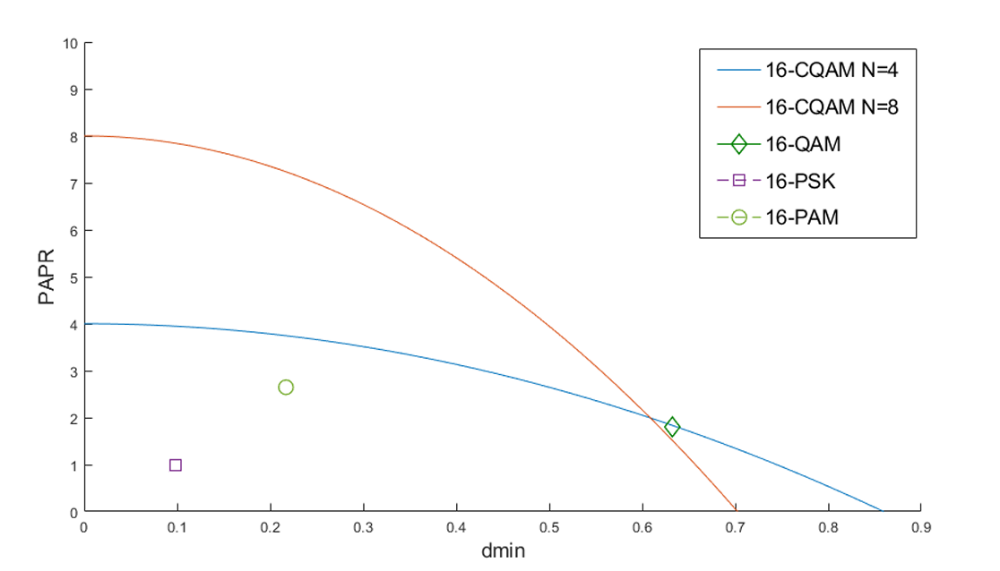
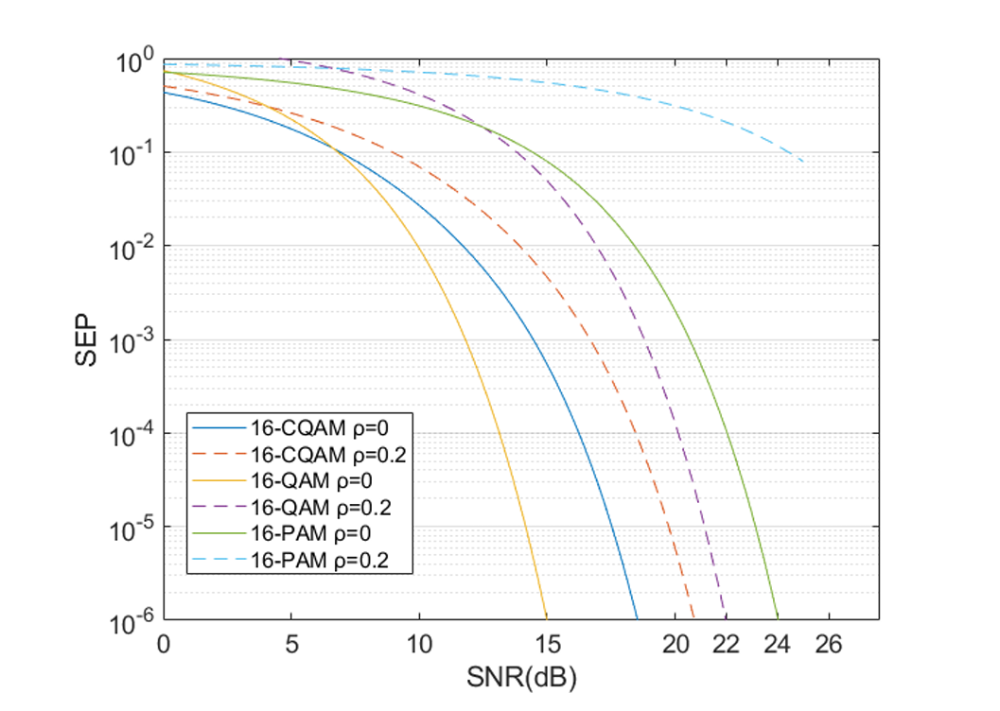

# SWIPT: Constellation Design & Performance Optimization

This repository contains the theoretical analysis and simulation framework for **Simultaneous Wireless Information and Power Transfer (SWIPT)** systems, developed for the Telecommunication Systems II course (ECE AUTh).

The project explores the fundamental trade-off between **Information Transfer (IT)** and **Power Transfer (PT)** by designing signal constellations that optimize both Symbol Error Probability (SEP) and Energy Harvesting (EH) efficiency.

## 📘 Project Overview

Traditional communication focuses on maximizing the minimum Euclidean distance ($d_{min}$). However, in SWIPT, efficient energy harvesting requires signals with high **Peak-to-Average Power Ratio (PAPR)** due to the non-linear sensitivity of EH rectifiers.

### 🔍 Key Tasks & Research Findings

#### 1. PAPR vs. Minimum Euclidean Distance ($d_{min}$) Analysis
We performed a comparative study of standard and specialized modulation schemes:
* **Modulation Schemes:** 16-QAM, 16-PSK, 16-PAM, and **16-Circular QAM (16-CQAM)** with 4 and 8 rings.
* **Core Logic:** Derived mathematical expressions for PAPR as a function of $d_{min}$.
* **Key Finding:** While 16-PSK has a constant PAPR of 1 (ideal for IT but poor for PT), **16-CQAM** provides a flexible trade-off. Our analysis shows that CQAM can maintain significantly higher PAPR values as $d_{min}$ varies, outperforming 16-PAM and 16-PSK in energy-harvesting potential.

#### 2. SEP vs. Energy Harvesting Trade-off
We evaluated the communication reliability of these schemes under power splitting constraints:
* **Metrics:** Symbol Error Probability (SEP) vs. Signal-to-Noise Ratio (SNR) and the power splitting fraction ($\rho$).
* **Comparative Performance:** * 16-QAM remains the baseline for low SEP in pure information transfer.
    * **16-sQAM (Spike QAM):** Our simulation results verify that 16-sQAM outperforms 16-CQAM by achieving higher PAPR and larger $d_{min}$ simultaneously, maintaining lower SEP at equivalent energy harvesting levels.
* **Verification:** Theoretical derivations for $P_e$ (using Q-functions and average symbol energy) were validated against Monte-Carlo simulation results.

---

## 💻 Mathematical Framework & Implementation

* **Constellation Geometry:** Coordinates derived for multi-ring Circular QAM and M-ary Spike QAM to satisfy unit average energy constraints.
* **PAPR Derivation:** Calculated as $PAPR = \frac{\max |s_i|^2}{E[|s_i|^2]}$.
* **SEP Modeling:** Analytical approximation of symbol error probability over AWGN channels, accounting for the fraction of power used for harvesting ($\rho$).

## 📂 Repository Content
The full technical report containing all mathematical derivations, performance plots, and comparative conclusions is available below:
👉 [SWIPT_Constellation_Analysis.pdf](./SWIPT_Constellation_Analysis.pdf)

---
## 📚 References
1. G. M. Kraidy et al., "Fundamentals of circular qam for wireless information and power transfer," SPAWC 2021.
2. M. J. L. Morales et al., "Optimum constellation for symbol-error-rate to papr ratio minimization in SWIPT," VTC2022-Spring.

*Developed at the Electrical and Computer Engineering Department, AUTh.*
